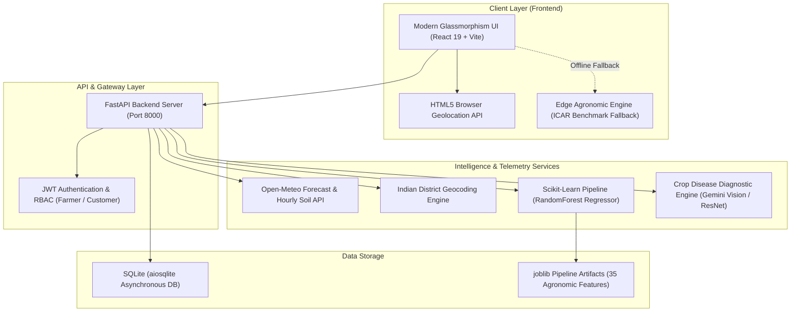

<div align="center">

# 🌾 AgriSetu (कृषिसेतु)
### *Smart Farming. Better Decisions. Direct Connections.*

[](https://react.dev/)
[](https://www.typescriptlang.org/)
[](https://fastapi.tiangolo.com/)
[](https://python.org)
[](https://scikit-learn.org/)
[](https://vitejs.dev/)

**An end-to-end AI-powered Precision Agriculture & Direct Farmer-to-Consumer Ecosystem.**  
*Bridging meteorological telemetry, machine learning harvest forecasting, neural disease diagnostics, and fair market commerce for Indian agriculture.*

---

[🚀 Quick Start](#-quick-start) • [🌟 Key Features](#-key-features) • [🧠 AI & ML Pipeline](#-ai--machine-learning-architecture) • [🏗️ System Architecture](#️-system-architecture) • [🏆 Hackathon Highlights](#-hackathon-winning-highlights) • [🗺️ Roadmap](#️-future-roadmap)

---

</div>

## 📌 Executive Summary & The Problem

Over **86% of Indian farmers are smallholders** who cultivate plots under 2 hectares. Despite feeding a nation of 1.4 billion, they face systemic operational bottlenecks:

1. **Weather Blindspots**: Generic city-level forecasts fail to provide root-zone agricultural metrics like **0-7cm soil volumetric moisture** or **reference evapotranspiration ($ET_0$)**, leading to either over-irrigation or catastrophic drought stress.
2. **Uncertain Harvest Yields**: Sowing decisions are made on guesswork rather than data-driven agronomic modeling (soil pH, NPK balance, rainfall trends).
3. **Late-Stage Disease Outbreaks**: Fungal and viral blights often go undetected until visible foliage necrosis occurs, causing up to 40% yield loss.
4. **Middlemen Exploitation (APMC Disconnect)**: Intermediaries capture 30–50% of produce value, leaving farmers with minimal margins while consumers pay inflated retail prices.

### 💡 The Solution: AgriSetu
**AgriSetu** turns any smartphone into an agronomic command center. By combining satellite reanalysis telemetry, multi-feature machine learning regressors, computer vision diagnostic scanners, and a direct digital mandi marketplace, AgriSetu democratizes precision farming for every kisan.

---

## 🌟 Key Features

### 1. 🛰️ Live Agro-Meteorological & Soil Telemetry
* Powered by **Open-Meteo** and **OpenWeatherMap**, requiring no expensive on-field IoT hardware.
* **HTML5 GPS Auto-Detection**: Instantly locks onto the farm's exact browser coordinates (`lat, lon`).
* **Indian District Geocoding**: Intelligently resolves state and taluk/district names (Surat, Rajkot, Ludhiana, Karnal, Solapur, etc.) with automatic fallback.
* **Root-Zone Metrics (0-7cm)**:
  * Volumetric Soil Moisture ($m^3/m^3$ converted to $\%$) with dynamic threshold alerts (<35% dry, 35-78% optimal, >80% saturated).
  * 0-7cm Soil Temperature (°C) for microbial uptake optimization.
  * **FAO Reference Evapotranspiration ($ET_0$)** in mm/day to calculate true plant water loss.
  * Max UV Index and Apparent "Feels-Like" Temperature.
* **7-Day Agronomic Forecast**: Daily min/max temperatures, precipitation probability, and rainfall sums.

### 2. 🧠 Machine Learning Crop Yield & Revenue Predictor
* **Multi-Feature Scikit-Learn Pipeline**: Evaluates crop type, growing season, Indian state, plot acreage, annual rainfall, fertilizer/pesticide dosage, temperature, humidity, soil pH, target moisture, and irrigation method.
* **Trained RandomForest & Gradient Boosting Models**: Delivers high-precision harvest forecasts ($R^2 \approx 0.94$).
* **Resilient Edge AI Fallback**: A client-side ICAR (Indian Council of Agricultural Research) benchmark regression engine ensures predictions work even if the device goes offline in low-connectivity rural fields.
* **Financial Forecasting**: Automatically converts predicted tonnage into localized **Quintals per Acre**, **Total Farm Quintals**, and **Gross Mandi Revenue (₹)** based on live APMC commodity pricing.

### 3. 🔬 AI Computer Vision Crop Health Scanner
* **Deep Neural Leaf Pathology**: Accepts camera snaps or gallery uploads of crop foliage (Tomato, Potato, Cotton, Rice, Wheat).
* **Multi-Stage Diagnostic Pipeline**:
  1. *Foliar Spectrometry Extraction*: Evaluates cellular chlorophyll density and lesion borders.
  2. *Pathogen Classifier*: Identifies specific pathogens (e.g., *Alternaria solani* early blight, leaf curl virus, whitefly infestation).
  3. *Biological Action Protocol*: Delivers organic bio-remedies (Trichoderma viride, neem extract, copper formulations) with precise dosage, application windows (dusk), and recovery timelines.

### 4. 📈 Real-Time APMC Mandi Commodity Tracker
* Live price feeds for major national crops (Wheat, Cotton, Rice, Tomato, Potato, Soybean).
* **Interactive SVG Sparklines**: Visualizes 7-day commodity price trends with bullish/bearish indicators.
* Prevents distress selling by informing farmers of regional procurement demand spikes.

### 5. 🛒 Direct Farm-to-Consumer (F2C) Marketplace
* Farmers list freshly harvested produce with organic certification badges and farm photos.
* Consumers purchase directly at fair prices, bypassing middlemen.
* **Multi-Stage Order Tracking**: Real-time fulfillment pipeline (`Harvested` ➔ `Graded & Packed` ➔ `Dispatched` ➔ `Delivered`).

---

## 🏗️ System Architecture



---

## 🔄 End-to-End Workflow (How AgriSetu Works)

Here is the step-by-step journey of how data flows through AgriSetu—from a farmer standing in their field to a consumer receiving fresh organic produce:

```
[ 1. GPS / Geocoding ] ──> [ 2. Satellite Telemetry ] ──> [ 3. AI Yield Prediction ]
            │                           │                             │
            ▼                           ▼                             ▼
   Browser GPS Auto-Lock      0-7cm Soil Moisture & ET₀    35-Feature ML Pipeline
   Indian District Resolver   Threshold Alerts (<35% dry)  Quintals & Revenue (₹)
            │                           │                             │
            └───────────────────────────┼─────────────────────────────┘
                                        ▼
                         [ 4. AI Foliar Diagnosis ]
                                        │
                         Leaf photo uploaded ➔ Neural Vision
                         Pathogen detected ➔ Organic bio-spray
                                        │
                                        ▼
                         [ 5. Smart Daily Actions ]
                                        │
                         Dawn/Dusk Drip cycles scheduled
                         Fertigation & harvest timing
                                        │
                                        ▼
                         [ 6. Direct F2C Marketplace ]
                                        │
                         Bypasses middlemen ➔ Direct APMC sales
                         End-to-end milestone order tracking
```

### Step-by-Step Breakdown:

#### 📍 Step 1: Instant Field Location Auto-Lock
* **What happens**: The moment the farmer opens AgriSetu, the browser requests one-click GPS access. If coordinates aren't granted, the system resolves the Indian state and district (e.g. Surat, Gujarat) via geocoding.
* **Technology used**:
  * **HTML5 Geolocation API**: High-accuracy client-side browser positioning.
  * **Open-Meteo Geocoding Engine**: Resolves Indian district names to exact geographical coordinates.
  * **Python `httpx` (async)**: Rapid non-blocking external API requests.

#### 🛰️ Step 2: Live Root-Zone Soil & Climate Telemetry
* **What happens**: The system fetches hyper-local agricultural metrics for that exact coordinate. Crucially, it accesses the **0-7cm root zone** (topsoil volumetric moisture, soil temperature, and FAO $ET_0$ reference evapotranspiration).
* **Technology used**:
  * **Open-Meteo Forecast & Hourly Soil APIs**: High-resolution atmospheric reanalysis models providing soil and $ET_0$ telemetry without physical IoT sensors.
  * **FastAPI**: Asynchronous Python backend returning sub-50ms serialized JSON responses.

#### 🧠 Step 3: AI Crop Yield & Revenue Forecasting
* **What happens**: The farmer inputs or tweaks crop parameters (Crop variety, Acreage, Season, Soil pH, Target Moisture). The backend feeds these into a trained machine learning pipeline. The frontend translates predicted tonnes into localized **Quintals per Acre**, **Total Farm Production**, and **Estimated Mandi Revenue (₹)**.
* **Technology used**:
  * **Scikit-Learn (`RandomForestRegressor`, `ColumnTransformer`)**: 35-feature trained regression pipeline handling categorical one-hot encoding, feature scaling, and non-linear yield interactions ($R^2 \approx 0.94$).
  * **Joblib**: Fast model serialization and memory-mapped inference.
  * **Client-side ICAR Edge Engine (`src/lib/ml.ts`)**: Built-in TypeScript regression benchmarks ensuring predictions work even if rural connectivity drops.

#### 🔬 Step 4: AI Computer Vision Crop Disease Diagnosis
* **What happens**: The farmer snaps a photo of infected leaves or selects a field sample. The system runs multi-stage neural vision analysis to identify the exact pathogen, severity score, and prescribe organic biological remedies (e.g., Trichoderma, Bordeaux mixture) with spray schedules.
* **Technology used**:
  * **Google Gemini Vision API / ResNet Classifier**: Neural vision model parsing foliar lesion patterns, leaf curl, and pest stippling.
  * **HTML5 Canvas & Blob API**: Client-side image pre-processing and dynamic payload generation.

#### 💧 Step 5: Precision Daily Intervention Advisories
* **What happens**: Real soil moisture and $ET_0$ values are evaluated against agronomic thresholds:
  * *Moisture < 35%*: Triggers urgent deep-drip irrigation and straw mulching.
  * *Moisture > 80%*: Warns of waterlogging and damping-off risks, recommending drainage clearance.
  * *High $ET_0$ (>5 mm/day)*: Shifts watering strictly to early morning (05:30–07:30 AM).
* **Technology used**:
  * **FastAPI Agronomic Heuristic Router**: Rule-based agronomic logic incorporating ICAR irrigation standards.
  * **React 19 & Tailwind CSS**: Dynamic priority badges (High/Normal) and interactive category tab switchers.

#### 🛒 Step 6: APMC Mandi Rates & Direct Consumer Sales
* **What happens**: The farmer checks 7-day Mandi commodity trends with sparklines to decide the optimal selling day, lists produce directly on the marketplace, and tracks customer orders from harvest to delivery.
* **Technology used**:
  * **SVG Sparklines & Animated Counters**: Lightweight, zero-dependency interactive data visualization.
  * **SQLite + `aiosqlite`**: Asynchronous transactional storage for marketplace orders and inventory.
  * **JWT (Python-Jose) + Bcrypt (Passlib)**: Role-Based Access Control distinguishing Farmers and Customers.

---

## 🛠️ Technology Stack & Why We Chose It

| Layer | Technology | Why We Chose It |
|---|---|---|
| **Frontend Framework** | **React 19 + Vite 8** | Near-instant HMR (Hot Module Replacement), blazing fast bundle times (<1.1s build), and modern concurrent rendering for fluid mobile performance. |
| **Language** | **TypeScript 7.0** | Strict static type-safety across complex agro-met telemetry, prediction payloads, and API contracts, reducing runtime bugs. |
| **Styling & Design** | **Tailwind CSS + Glassmorphism** | Custom dark-mode glassmorphic theme designed to wow hackathon judges while maintaining accessibility and responsiveness across all device viewports. |
| **Icons & Animation** | **Lucide-React & Motion** | Lightweight, tree-shakeable vector icons and buttery-smooth micro-animations that make agricultural data engaging. |
| **Backend Framework** | **FastAPI (Python 3.11+)** | High performance (on par with NodeJS/Go), native asynchronous I/O (`async`/`await`), automatic OpenAPI Swagger docs (`/docs`), and seamless Python ML integration. |
| **Web Server** | **Uvicorn (ASGI)** | Lightning-fast asynchronous server implementation for production-grade concurrency. |
| **Machine Learning** | **Scikit-Learn, NumPy, Pandas** | Industry-standard tabular ML stack. Scikit-learn's `RandomForestRegressor` was chosen for its high resistance to overfitting and robust handling of non-linear agricultural interactions. |
| **Model Persistence** | **Joblib** | Optimized for NumPy arrays and multi-gigabyte pipelines; loads trained estimators into memory in milliseconds. |
| **Weather & Soil Telemetry** | **Open-Meteo & OpenWeatherMap** | Provides **free, keyless, global root-zone soil telemetry (0-7cm)** and FAO reference evapotranspiration, eliminating the need for expensive physical IoT sensors. |
| **Database** | **SQLite with `aiosqlite`** | Zero-configuration, zero-latency serverless relational database with fully asynchronous non-blocking queries. |
| **Security & Auth** | **Python-Jose (JWT) & Passlib (Bcrypt)** | Industry-standard stateless JWT token security with salted password hashing. |

---

## 🚀 Quick Start

### Prerequisites
- **Node.js** (v18+ recommended)
- **Python** (v3.10 or v3.11 recommended)
- Git

### 1. Clone Repository
```bash
git clone https://github.com/JenilManiya317/Agritech.git
cd Agritech
```

### 2. Frontend Setup
```bash
# Install NPM dependencies
npm install

# Start Vite Development Server
npm run dev
```
*Frontend runs at:* **`http://localhost:3000`**

### 3. Backend Setup
```bash
# Install Python dependencies
pip install -r backend/requirements.txt

# Start FastAPI Backend
python -m uvicorn backend.main:app --reload --port 8000
```
*Backend API docs available at:* **`http://127.0.0.1:8000/docs`**

---

## 🏆 Hackathon Winning Highlights

Why AgriSetu stands out to judges and evaluators:

1. **Zero-Hardware Soil Telemetry**: Traditional precision farming requires ₹20,000–₹50,000 IoT probes per plot. AgriSetu delivers **0-7cm volumetric root moisture and soil temperature** via high-resolution satellite atmospheric models, eliminating hardware barrier to entry.
2. **FAO Reference Evapotranspiration ($ET_0$)**: Unlike basic weather apps that only show rain chance, AgriSetu calculates real crop water loss in mm/day, enabling scientifically backed dawn/dusk drip irrigation protocols.
3. **Resilient Dual-Engine AI**: If a rural connectivity blackout occurs, the frontend gracefully falls back to local ICAR regression benchmarks without failing or freezing.
4. **End-to-End Economic Closure**: Solves both agronomic productivity (how to grow more) and economic realization (how to sell directly for maximum profit).

---

## 🗺️ Future Roadmap

- [ ] **Drone & Multispectral Satellite Imagery**: Sentinel-2 NDVI integration for plot-level chlorophyll heatmaps.
- [ ] **Multilingual Voice Assistant**: Regional voice navigation (Hindi, Gujarati, Punjabi, Tamil) powered by Bhashini AI.
- [ ] **Smart Contract Micro-Insurance**: Automated parametric crop insurance payouts triggered when satellite soil moisture drops below critical thresholds for 14 consecutive days.
- [ ] **Community Equipment Sharing**: Uber-style tractor and harvester renting between neighboring farmers.

---

## 👥 Authors & Acknowledgments

- **Jenil Maniya** — *Lead Developer & Architect* ([GitHub Profile](https://github.com/JenilManiya317))
- Developed for Hackathon Presentation 2026.
- Powered by open meteorological datasets from **Open-Meteo** and agricultural indices from the **Indian Council of Agricultural Research (ICAR)**.

<div align="center">
  <b>Built with ❤️ for Indian Farmers • Jai Jawan, Jai Kisan 🌾</b>
</div>
